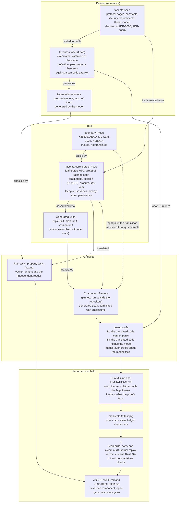

# tacenta-core

A verification-first implementation of selected published Signal Protocol
specifications: a small, standalone cryptographic core with machine-checked
proofs over its verified zone.

## What this is

**The specification is the product.** [tacenta-spec](tacenta-spec/) defines
the protocol, its wire and storage formats, and the rules a reader enforces.
[tacenta-model](tacenta-model/) states the same definition formally, and the
protocol vectors it generates are normative examples of it.
[tacenta-core](tacenta-core/) is one implementation of that specification,
the project's own. Where the implementation and the specification disagree,
the implementation is wrong until the specification is amended, and a change
to anything the specification defines is made to the specification first
([ADR-0006](tacenta-spec/decisions/ADR-0006-specification-is-normative.md)).

The cryptographic foundation behind [Tacenta](https://tacenta.com), built to
stand on its own. It is
protocol, cryptography, and their verification, nothing else: no product
coupling, no application policy, no services. Tacenta is its first consumer, but
it is meant to serve other projects too, the way libsignal does. Each of the
five components is built to lift into its own public repository; they live
together here while the work matures.

This implementation is designed to be inspected and its stated proof claims
reproduced. Its supported protocol surface and interoperability limits are
stated below. It is not yet packaged for installation from a registry; today the
way to engage with it is to read the specification and verify the proofs (see
"Verify it yourself" below).

## Development assistance

Tacenta is developed by human engineers using automated and AI-assisted tools.
Those tools assist implementation, specification text, test harnesses and review
preparation; the project maintainer remains accountable for accepting changes.
Tool-assisted checks and reviews are evidence of what they ran, not independent
review, and assurance records identify their scope and limits.

## The mission

> Build a small, stable, verification-first engine for selected published Signal
> Protocol specifications, with narrowly stated and reproducible compatibility
> results.

Every phrase is a constraint, and each is meant to be falsifiable:

- **Small.** Only security-critical protocol functionality is in the core.
- **Stable.** Tacenta owns and versions its public API.
- **Verification-first.** Specifications, models, and evidence are meant to precede claims;
  `ASSURANCE.md`, practice 1, says where that has not yet been true.
- **Interoperable on the wire.** Match another implementation's protocol
  *behaviour*, not its API architecture. What that covers today is stated below.
- **Explicitly supported versions.** Compatibility is bounded, never
  universal, and no compatibility test against another implementation is recorded yet.
- **No product coupling.** Storage and device abstractions belong; application
  policy and unrelated services do not.

## What is and is not claimed

Two of the constraints above carry limits worth stating plainly.

- **Interoperability reaches the bundle layer, not the message layer.** The
  target is exchanging prekey bundles and establishing a session with a pinned
  libsignal release, with any result claimed by version and covered surface
  (ADR-0004). Ongoing messages are not exchanged across implementations: the
  key-derivation constants sit upstream of
  every message byte, no published specification carries test vectors for them,
  and black-box observation cannot recover them. The target is scoped to the
  bundle layer accordingly, and no cross-implementation run is recorded in this
  tree.
- **Stable is a goal, not a state.** There is no versioning policy, deprecation
  policy, or supported-target matrix yet.

`ASSURANCE.md` says where the project stands on two of the other four
constraints, Small and Verification-first (practices 3 and 1). The other two,
explicitly supported versions and no product coupling, have no assurance row yet.
`tacenta-proofs/CLAIMS.md` is the precise
record of what is proven. Where this README and that document ever disagree,
that document is right.

## Components

- **[tacenta-spec](tacenta-spec/)**, the protocol and security specification,
  written as prose: the normative definition.
- **[tacenta-model](tacenta-model/)**, the executable, formal statement of the
  same specification, and the source of the protocol vectors.
- **[tacenta-proofs](tacenta-proofs/)**, the Lean proofs and a reproducible
  verification environment.
- **[tacenta-test-vectors](tacenta-test-vectors/)**, interoperability vectors
  and conformance tests.
- **[tacenta-core](tacenta-core/)**, one implementation of the specification,
  in Rust.

## How it fits together

The specification is the product, so the picture starts there. Arrows point
from a piece to what consumes it or is built from it.

- **Defined, built, checked, recorded.** The specification and the model say
  what the behaviour is. The Rust crates are one implementation of it. The
  checks ask whether the implementation does what the definition says. The
  record says which of those checks are claimed, what each one assumes, and
  what is still open.
- **Two kinds of evidence about the Rust.** Tests, fuzzing, the vectors the
  model generates and the independent reader show that the code agrees with
  the model on the cases they cover. The Lean proofs are about the translated
  code: T1 says a function cannot panic, T3 says it refines the model. The
  README's Status section says which crates carry which theorems.
- **Units.** The Triple Ratchet, the Braid and the session lifecycle are
  translated as generated units that assemble the leaf crates into one crate,
  so that Charon sees a composition with its leaves instead of over opaque
  axioms. Nothing links against a unit and none is published.
- **Where trust sits.** The boundary crate and the Charon and Aeneas toolchain
  are trusted and not verified here. A proof reaches the boundary through
  contracts that appear as hypotheses of the theorems that take them.
  `tacenta-proofs/LIMITATIONS.md` lists what a reader must still trust, and
  `tacenta-proofs/CLAIMS.md` lists every claimed theorem with its hypotheses.
- **What holds the record in place.** `attest.py` compares the ledger with the
  proofs and pins the axioms each claimed theorem uses, and the CI jobs
  replay the proofs through the kernel and scan for `sorry`. A passing build
  shows the claims hold as stated. It does not show that a hypothesis can be
  met, which is why `GAP-REGISTER.md` keeps the open questions and
  `ASSURANCE.md` keeps the readiness gates.
- **Not in the picture.** The release tags (`tacenta-spec-v*` and
  `tacenta-assurance-v*`), the hostile reviews, and the Tacenta product that
  consumes this repository.

## Status

Eight crates carry T1 panic-freedom and T3 refinement theorems over their
translated Rust: `tacenta-wire` (the decoders), `tacenta-ratchet`,
`tacenta-session` (the PQXDH derivation only), `tacenta-spqr`, `tacenta-braid`,
`tacenta-triple`, `tacenta-protobuf` and `tacenta-erasure` (T1 for the coder, T3
for the field arithmetic only). A ninth, `tacenta-lifecycle`, has conditional
panic-freedom theorems on the eight-leaf session unit, three of which took a record with a false
field until it was restated (`GAP-REGISTER.md`, row `SESSION-CONTRACT-VACUITY`; the records are shown inhabited only in the sense
and under the laws recorded in `tacenta-proofs/LIMITATIONS.md`, and not for their headroom records), and no
refinement theorem.
The Braid's T3 theorems take a live-encoder and an unspliced-stream precondition and, for the receive, the bound `ct1_bounded` on the stored KEM ciphertext; on the eight-leaf session unit they also take the bound `decoders_bounded` on the erasure decoders. `tacenta-proofs/CLAIMS.md` has theorems that every successful send and receive of the Braid keeps both bounds, from a state that also meets a clause about the decoder that makes the stored ciphertext, under an assumed law about the erasure decoder (on the session unit, two laws about `Vec::truncate` and `usize::div_ceil`).
`Session::encrypt` and `Session::decrypt` are not proved end to end. The post-quantum ratchet is in the
session path, and sessions and prekey stores serialize.
`tacenta-proofs/CLAIMS.md` records exactly what is and is not proven.
`ASSURANCE.md` records where the project stands against the expectations in
ADR-0008, component by component, and what comes next.

## Verify it yourself

The aim of a verification-first library is that you do not have to take its
word for it. This one does not yet meet that aim in full:
`tacenta-proofs/LIMITATIONS.md` lists what a reader must still trust, and
`ASSURANCE.md` lists what no one outside the project has checked. `tacenta-proofs/CLAIMS.md` states each claim;
`tacenta-proofs/REPRODUCING.md` is how to rebuild the proofs, and
`tacenta-test-vectors/README.md` ("Regenerating the protocol vectors") is how
to check the committed vectors against the model. The model and the
model-layer proofs reproduce on any machine, and the committed Rust-to-Lean
translation with its T1/T3 proofs builds in the public `translation` CI job.
Only regenerating that translation from the Rust needs the pinned
Charon/Aeneas toolchain, which runs outside this repository (see below); the
release and archive digest are stated in `tacenta-proofs/CLAIMS.md` so that
step can be reproduced elsewhere.

## Building and checking

One command runs the gate: `bash tooling/ci.sh`. The public CI
(`.github/workflows/ci.yml`) runs the same steps on every push and pull
request, split into jobs so a failure names its cause. The gate is: the
workflow, proof-hygiene, label, vector-schema and authentication-boundary
checks under `tooling/` (with the workflow checker held to its own case files
under `tooling/tests/`); the sign-off check, which reads the commits a branch
or pull request adds on top of main (CONTRIBUTING.md); the Lean
model build and the model-layer proofs with
their `sorry` scan; the attestation check; the committed vectors regenerated
from the model and compared; the Rust crates (format, lint, tests,
property-based decoder tests) with a dependency advisory audit, a compile
check on the minimum supported Rust version, a 32-bit compile check, and the
constant-time disassembly gate (the release assembly of the two hand-written
constant-time functions, read for conditional branches); and the committed
Rust-to-Lean translation with its T1/T3 proofs, built and scanned for
`sorry`. In the workflow a pull request reuses the Lean build outputs of the
newest successful push to main with the same toolchain and dependency pins, and
rebuilds only what its changes invalidate. A module that did not change is not
re-elaborated on the pull request: the messages main's build logged for it, which
the `sorry` scan and the axiom comparison read, are replayed. Every push to main
builds from nothing, and every run replays the modules under `Translation/`,
`Proofs/`, `Model/` and `Properties/` through the kernel. Pull requests run on
GitHub-hosted machines; a push to main runs the two Lean jobs on a self-hosted
runner that GitHub lets only this workflow, as it is on main, use.

The two do not run exactly the same set, and the difference is stated
rather than papered over. Five of those steps need tooling the workflow
installs and a developer's machine may not have; the workflow always runs
them, and the script skips each one it cannot run and prints a line saying
so: the advisory audit (`cargo-audit`), the MSRV check (a 1.87 toolchain),
the 32-bit check (the armv7 target), the Linux halves of the constant-time
disassembly gate (the x86_64 and aarch64 Linux targets; the host is always
read), and the translation build (the translation's Mathlib cache, which is
the heavy one). In the other direction
the script runs two steps the workflow does not: the interoperability
harness, which is not in this public tree and skips here, and the fuzz smoke
run, which needs `cargo-fuzz` and a nightly toolchain. The workflow also runs steps the
script does not: the SPQR erasure regression (`rust_spqr_erasure`), the receipt
writers and the aggregation job. So a green local run is the gate above less the
steps it printed a skip line for, and it has not run the steps only the
workflow runs.

| Prerequisite | Version | Used by |
| --- | --- | --- |
| Rust toolchain (`cargo`, `clippy`, `rustfmt`) | stable | the Rust crates and the vector runner |
| `rustup toolchain install 1.87` | 1.87, the `rust-version` every crate names | the MSRV compile check; skipped locally when absent, failed in CI |
| `cargo-audit` (`cargo install --locked cargo-audit`) | any current release | the advisory audit; skipped locally when absent, failed in CI |
| `rustup target add armv7-linux-androideabi` | matching the toolchain | the 32-bit compile check; skipped locally when absent, failed in CI |
| `rustup target add x86_64-unknown-linux-gnu aarch64-unknown-linux-gnu` | matching the toolchain | the constant-time disassembly gate (`tooling/check-constant-time-asm.sh`), which reads the release assembly of `mac_eq` and `calculate_key_pair`; the host is always read, a missing Linux target is skipped locally, and CI fails with neither present |
| Lean, through elan | the version `tacenta-model/lean-toolchain` and `tacenta-proofs/lean-toolchain` name (v4.31.0) | the model, the proofs, vector regeneration, and the differential harness the vector runner drives (`tacenta-model/Difftest.lean`) |
| the translation's Mathlib cache (`cd tacenta-proofs/translation && lake exe cache get`) | the commit `tacenta-proofs/translation/lake-manifest.json` pins | the translation build and its `sorry` scan; skipped when the cache has not been fetched (the test is for a built `Mathlib.olean`, not the package directory) |
| `python3` with PyYAML (`pip install pyyaml`) | 3.8 or later | the `tooling/` checks; PyYAML is for the workflow check, which skips locally without it and fails in CI |
| `git` | any | the vector-currency diff |

Individual pieces can be run on their own: `cargo test --locked --workspace`
in `tacenta-core`; `cargo test --locked` in
`tacenta-test-vectors/runners/rust`, whose differential harness also needs
`lake build` in `tacenta-model` and says so when it skips for want of it;
`lake build` in `tacenta-model`; `scripts/verify.sh` in `tacenta-proofs`. CONTRIBUTING.md has the pre-push
hook that runs the cheapest of the checks before a push leaves the machine.

Three things run outside this repository, and the gate says so rather than
pretending to run them. **Regenerating the Rust-to-Lean translation** needs
the pinned Charon and Aeneas release, which is a linux-x86_64 binary that
runs on a dedicated runner; the committed translation is what the public
`translation` job checks, and `tacenta-proofs/CLAIMS.md` records the release
and its digest so the regeneration can be reproduced elsewhere.
**Coverage-guided fuzzing** needs `cargo-fuzz` and a nightly toolchain and
runs for hours, so the search is a nightly job on private infrastructure;
`tooling/fuzz-smoke.sh` replays the committed corpus when the tooling is
present, and `tacenta-core/fuzz/README.md` describes the targets. **Timing
measurements** need a dedicated machine, since a job co-scheduled with other
load on a shared hosted runner cannot tell a leak from noise;
`tacenta-core/tests/timing.rs` carries the tests, run by hand or by a nightly
job outside this repository, and `tacenta-proofs/LIMITATIONS.md` states what
is and is not established about constant-time behaviour. None of the three
changes what the public gate proves; each is named here so that a reader
knows what a green badge does not include.

## Provenance

tacenta-core is a clean-room implementation. Its inputs are the published
Signal Protocol specifications, pinned by SHA-256 in
`tacenta-test-vectors/conformance-manifest.md`; the standards those
specifications cite; this project's own specification, model, and vectors; and,
where a published specification leaves a wire-level convention to the
implementer, black-box observation of a pinned build of a third-party
implementation under the interoperability research boundary (ADR-0003,
ADR-0005), with each such value and its provenance recorded in
`tacenta-spec/CONSTANTS.md`. libsignal's source code, tests, fixtures, schemas,
and internal documentation are not inputs to this project. The public API is
independently designed and does not reproduce libsignal's.

This tree contains no libsignal implementation source, compiled libsignal
objects, reference-adapter implementation, research transcripts, or
libsignal-derived fixtures.

## License

Apache-2.0. See `LICENSE`.

## Trademarks and non-affiliation

tacenta-core and Tacenta are not affiliated with, endorsed by, or sponsored by
Signal Messenger LLC or the Signal Foundation. "Signal" and "libsignal" are used
only to name the published protocols and the third-party software they refer to.
